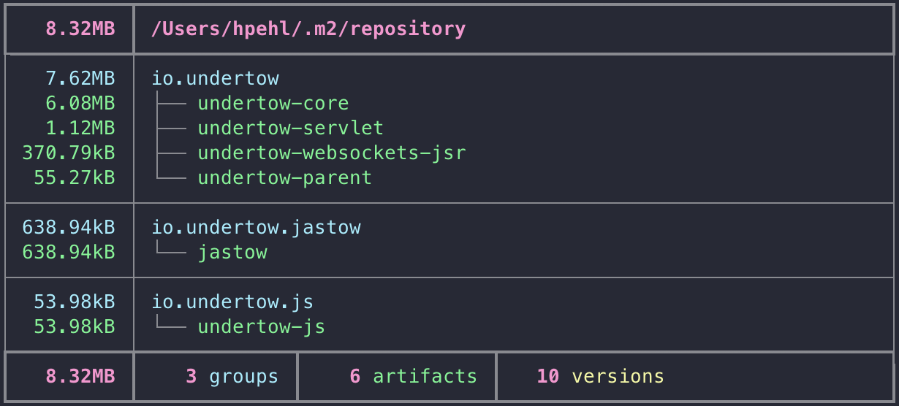
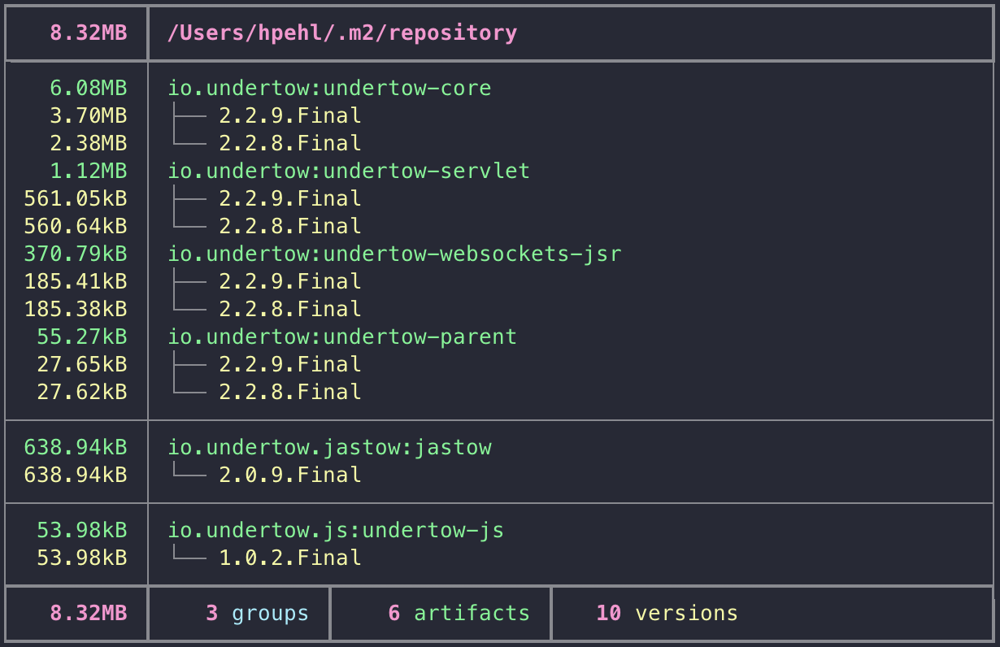
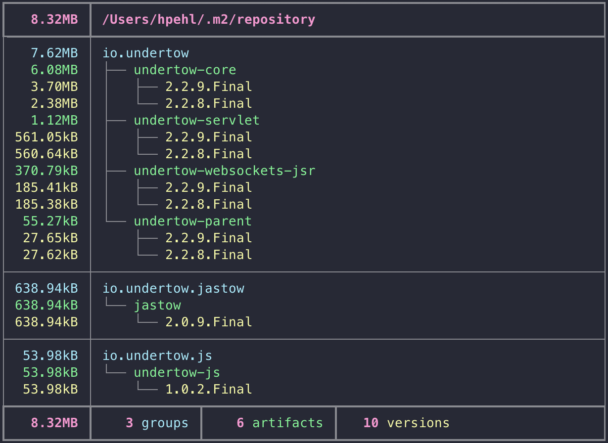

# Disk Usage Samples

The `du` subcommand analyzes the local maven repository. It accepts the same filters as the `keep` and `rm`subcommands, but does not remove artifacts. Instead, it selects the artifacts matched by the filter and calculates the size of the groups, artifacts and versions.

Using the `du` subcommand, you can get a quick overview of the artifacts or take a deep look inside the repository. Use the `-o, --output <OUTPUT>` option to define the granularity of the usage report. 

## Samples

To get a better understanding, here are some screenshots of usage reports. All samples use the same group and different output options: 

### Groups

```shell
mcup --groups io.undertow du -og
```


### Artifacts

```shell
mcup --groups io.undertow du -oa
```


### Versions

```shell
mcup --groups io.undertow du -ov
```


### Groups & Artifacts

This is the default setting. So the two commands produce the same report.

```shell
mcup --groups io.undertow du
mcup --groups io.undertow du -oga
```



### Groups & Versions

```shell
mcup --groups io.undertow du -ogv
```


### Artifacts & Versions

```shell
mcup --groups io.undertow du -oav
```



### Groups, Artifacts & Versions

```shell
mcup --groups io.undertow du -ogav
```


